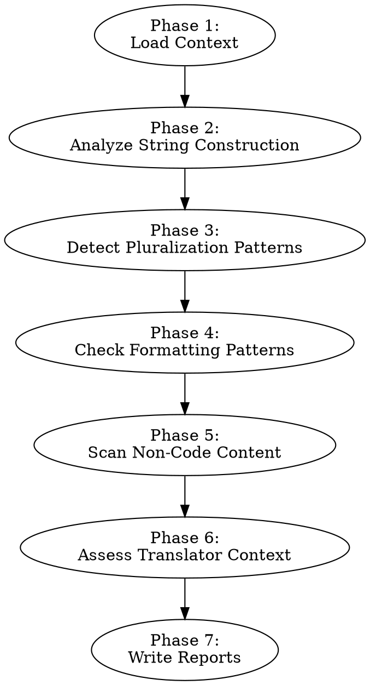

# Auditing I18n String Patterns

Analyze a codebase's string management techniques and locale-sensitive formatting to produce two outputs:

1. **Pre-extraction formatting fixes** (written to `i18n-pre-extraction-fixes.md`) — hardcoded date/number/currency formatting that should be centralized behind locale-aware APIs before extraction begins.
2. **Extraction pattern catalog** (written to `i18n-extraction-pattern-catalog.md`) — an inventory of string construction techniques (concatenation, interpolation, pluralization utilities, inline ternaries, etc.) with locations, conversion recipes, and gotchas for the extraction step.

**Announce at start:** "I'm using the auditing-i18n-string-patterns skill to analyze string construction and formatting patterns."

## Categorization Framework

Not every localization issue needs to be "fixed" before extraction. The key question is: **does fixing this produce value independent of extraction, or is the fix inseparable from extraction itself?**

### Pre-Extraction Fix (fix now)

A finding belongs here if:
- The fix is **library-agnostic** — it improves code quality regardless of which i18n library is chosen
- The fix **reduces surface area** the extraction agent must reason about
- The fix is a **bug** independent of i18n concerns
- The pattern involves **formatting APIs** (dates, numbers, currency) that should be centralized behind locale-aware wrappers

Examples: Hardcoded `'en-US'` in `toLocaleString` calls, date formatting utilities using hardcoded format strings, currency symbols hardcoded in JSX, bugs found during the audit.

### Extraction Pattern (catalog for extraction)

A finding belongs here if:
- **The fix IS the extraction** — restructuring to an intermediate form would be throwaway work
- The extraction step directly converts the pattern to ICU message format in one step
- There is no useful intermediate representation between the current code and the i18n version

Examples: Template literals building sentences (`\`Hello ${name}\`` → `t('greeting', { name })`), ternary text switching, pluralization utilities and ternary plurals (replaced by ICU `{count, plural, ...}`), title/placeholder/aria-label attributes.

### Edge Cases

Some string construction is **so tangled** (multi-line assembly, conditional logic spanning functions) that simplifying the code logic first — without any i18n changes — would meaningfully reduce extraction risk. These are pre-extraction fixes even though they involve strings, because the value is in simplifying the code, not in doing partial i18n work. The bar for this is high — most concatenation, even if messy, is better handled in one step during extraction.

## When to Use

- Analyzing what string patterns exist and how extraction should handle them
- Identifying formatting issues to fix before extraction
- Building a pattern catalog that guides extraction tooling
- Finding non-code localizable content (a11y attributes, HTML attributes, CSS content)
- Evaluating whether translators will have enough context

**Do not use for:** Discovering the scope of hardcoded copy (use auditing-i18n-scope), analyzing tone (use auditing-i18n-tone), checking terminology consistency (use auditing-i18n-terminology), or running a full readiness audit (use auditing-i18n-readiness, which orchestrates all skills including this one).

## Process

Follow these phases in order. Write pre-extraction formatting findings to `i18n-pre-extraction-fixes.md` and extraction patterns to `i18n-extraction-pattern-catalog.md`. Create either file if it does not exist. If the scope skill has already run, consume its tech stack and string inventory from `i18n-pre-extraction-fixes.md`. If not, perform a lightweight discovery pass first.



### Phase 1: Load Context

- Check if `i18n-pre-extraction-fixes.md` exists with scope data
- If yes: read tech stack and string inventory from the report
- If no: perform lightweight discovery — scan dependency files (package.json, Podfile, build.gradle) to detect the tech stack, then sample up to 20 UI-rendering files for string patterns. This is not a complete inventory — just enough context to proceed with analysis.

### Phase 2: Analyze String Construction

Scan for patterns that break when translated. Different languages have different word order, grammatical gender, and sentence structure.

**These findings go in `i18n-extraction-pattern-catalog.md`** — the extraction step converts them directly to ICU message format. There is no useful intermediate form.

**Exception:** If a string construction pattern is genuinely tangled (multi-line assembly across variables, conditional logic spanning functions, fragments assembled across files), and simplifying the *code logic* would meaningfully reduce extraction risk, categorize it as a pre-extraction fix.

**Concatenation:**
```
// PROBLEM: word order differs across languages
"Hello, " + userName + "! You have " + count + " new messages."

// Extraction converts to: t('welcome', { userName, count })
// ICU: "Hello, {userName}! You have {count} new messages."
// German reorders: "Hallo, {userName}! Sie haben {count} neue Nachrichten."
// Japanese restructures: "{userName}さん、こんにちは！新しいメッセージが{count}件あります。"
```
Find: `+` operators joining string literals with variables, template literals building sentences from parts, `String.format` with sentence fragments.

**Interpolation with embedded logic:**
```
// PROBLEM: ternary inside template switches text fragments
`Sign ${userHasAccount ? 'in' : 'up'} with code`

// Extraction creates two separate message IDs:
// t('auth.signInWithCode') → "Sign in with code"
// t('auth.signUpWithCode') → "Sign up with code"
```
Find: ternary operators inside strings that switch text.

**Sentence fragments:**
```
// PROBLEM: assembling sentences from separate strings/variables
const greeting = getGreeting();  // "Good morning"
const message = greeting + ", " + userName;  // Can't reorder

// Extraction creates a single message with all context:
// t('greeting', { timeOfDay, userName }) → "{timeOfDay}, {userName}"
```
Find: variables holding partial sentences that get assembled elsewhere.

For each pattern found, record:
- The **technique** (concatenation, template literal, ternary switch, fragment assembly)
- **Location** (file, line)
- **Example** (the actual code)
- **Conversion note** (how extraction should handle it — separate messages, ICU placeholders, etc.)
- **Gotchas** (e.g., "ternary switches a single word mid-sentence — need two complete separate messages, not one message with a placeholder for the differing word")

### Phase 3: Detect Pluralization Patterns

How does the app handle plural forms today? **All pluralization findings go in `i18n-extraction-pattern-catalog.md`** — the extraction step replaces them with ICU plural syntax. There is no value in standardizing English-only pluralization before extraction.

| Pattern | Assessment | Extraction Conversion |
|---------|------------|----------------------|
| `count === 1 ? "item" : "items"` | English-only, handles 2 forms. Arabic needs 6, Polish needs 4. | `{count, plural, one {# item} other {# items}}` |
| Custom `pluralize()` utility | English-only. Check for exceptions map with irregular plurals. | Delete utility. Use ICU plural at each call site. Preserve irregular forms from exceptions map. |
| `if (count === 0) ... else if (count === 1) ... else ...` | Handles zero/one/other but misses many languages. | `{count, plural, zero {...} one {...} other {...}}` |
| Verb conjugation tied to count (`has/have`, `is/are`) | Both noun and verb must be inside the plural block. | `{count, plural, one {# row has} other {# rows have}}` |
| Using `Intl.PluralRules` or equivalent | Language-aware — good existing pattern. | May already be compatible with i18n library. |
| Using i18n library pluralization (ICU `{count, plural, ...}`) | Already correct. | No change needed. |

For each pattern found, record the technique, count of occurrences, example locations, and the conversion recipe — including gotchas (e.g., "utility has an exceptions map for irregular plurals — check the map and preserve irregular forms in ICU messages").

### Phase 4: Check Formatting Patterns

Scan for hardcoded locale-sensitive formatting. **These findings go in `i18n-pre-extraction-fixes.md`** — centralizing formatting behind locale-aware APIs is independent of string extraction and should be done first.

**Why pre-extraction:** Formatting APIs (`Intl.DateTimeFormat`, `Intl.NumberFormat`) accept a locale parameter. Making them locale-aware is a code quality improvement that works regardless of which i18n library is chosen for strings. Doing it first means the extraction agent doesn't need to reason about formatting concerns — it only handles strings.

**Dates:**
- Hardcoded format strings: `MM/DD/YYYY`, `DD.MM.YYYY`
- `toLocaleDateString()` without explicit locale argument (uses system locale — inconsistent)
- `new Date().toISOString()` displayed to users (technical format)
- `DateFormatter` (Swift) or `SimpleDateFormat` (Java/Kotlin) with hardcoded patterns
- Date formatting utilities wrapping libraries (e.g., date-fns) with hardcoded English format strings

**Numbers:**
- `toFixed(2)` for currency display (decimal separator varies by locale)
- Manual comma/period insertion for thousands separators
- Hardcoded decimal separators
- `toLocaleString('en-US')` or other hardcoded locale

**Currency:**
- Hardcoded symbols: `$`, `EUR`, `USD` prepended/appended to amounts
- Symbol position varies by locale (`$10` vs `10 $` vs `10$`)
- `Intl.NumberFormat` with hardcoded locale or currency

**Measurements:**
- Hardcoded unit labels: "kg", "miles", "inches"

Rate each as:
- **Blocker:** User sees wrong format for their locale (hardcoded `en-US`, hardcoded `$`)
- **Warning:** Inconsistent but functional (missing locale arg defaults to system locale)

### Phase 5: Scan Non-Code Content

Find localizable content outside of typical source strings. **These findings go in `i18n-extraction-pattern-catalog.md`** — they are extraction targets that the extraction agent needs to locate and handle.

**Images and SVGs:**
- Images with embedded text (screenshots, diagrams, marketing banners)
- SVGs with `<text>` elements containing hardcoded strings
- These require asset variants per locale

**CSS content:**
- `content: "..."` in stylesheets (::before, ::after pseudo-elements)
- Often used for decorative text, icons-with-labels, or status indicators

**Accessibility attributes:**
- `aria-label`, `aria-placeholder`, `aria-roledescription`
- `alt` text on images
- `title` attributes on elements
- `contentDescription` in Android XML/Compose
- `accessibilityLabel` in SwiftUI
- These are read aloud by screen readers and must be translated

**HTML attributes:**
- `placeholder` text on inputs
- `title` attributes (tooltips)
- Confirmation dialog messages (often passed as string arguments)

**Email templates, push notifications, in-app messages:**
- Often in separate template files or backend config
- Easy to miss during a code-focused audit

For each category, record the count, example locations, and any gotchas (e.g., "some placeholder attributes contain interpolated values — these need ICU placeholders, not plain extraction").

### Phase 6: Assess Translator Context

Evaluate whether translators will be able to produce good translations from extracted strings.

**Ambiguous strings** — these feed both pre-extraction glossary work and extraction-time descriptions:
- Short strings with multiple meanings: "Post" (verb: submit / noun: article), "Set" (verb: configure / noun: collection), "Save" (verb: store / noun: discount)
- Strings that need grammatical context: "New" (masculine? feminine? neuter? depends on language)
- **Pre-extraction action:** Feed ambiguous terms into the terminology skill's glossary. Resolve which meaning applies in each usage context before extraction begins.
- **Extraction action:** Each extracted message should include a `description` or `context` field for translators explaining the meaning in context.

**Variable context:**
- Strings with placeholders where the variable's type/meaning isn't obvious: `"Updated {0} ago"` — is `{0}` a time duration? A date? A name?
- Strings where the variable affects grammar: `"Delete {name}?"` — in German, the article before `{name}` depends on the noun's gender

**String organization assessment:**
- Are strings in constant files, inline, or mixed?
- Is there any existing centralization the extraction should preserve or build on?
- What naming convention should extraction keys follow? (If the terminology skill has run, reference its glossary for semantic key naming.)

**Product names and untranslatable terms:**
- Identify brand names, feature names, and technical terms that should NOT be translated
- These need to be listed so the extraction agent preserves them as-is and adds translator notes marking them as non-translatable

### Phase 7: Write Reports

Write to two separate files:

#### `i18n-pre-extraction-fixes.md` — Formatting Fixes

Append a "Pre-Extraction Fixes" section (or replace if it already exists) with formatting and structural issues found in Phases 4 and 2 (tangled logic only).

1. **Summary:** Total pre-extraction issues found, breakdown by severity (blockers / warnings)
2. **Issues table:** For each issue category:

| Category | Severity | Count | Example | Remediation |
|----------|----------|-------|---------|-------------|
| Hardcoded date formats | Blocker | 19 | `Occasion.ts:62` — `'h:mm a'` | Centralize through `Intl.DateTimeFormat` with locale param |
| Hardcoded locale in API calls | Blocker | 5 | `Contact.ts:93` — `toLocaleString('default')` | Pass explicit locale parameter |
| Hardcoded currency | Blocker | 7 | `aura.ts:54` — `'$0'` | Use `Intl.NumberFormat` with locale-aware currency |
| Bug: wrong variable | Blocker | 1 | `TimelineList.tsx:50` | Fix variable reference |
| Tangled string logic | Warning | 3 | `SharedResourceUtilityBar:83` | Simplify multi-line template assembly |

3. **Effort estimate** per category: small (< 1 day), medium (1-3 days), large (3+ days)
4. **Bugs found during audit** that should be fixed before extraction
5. Contribute items to **Recommended Next Steps**

#### `i18n-extraction-pattern-catalog.md` — Extraction Pattern Catalog

Create or replace this file with the full pattern catalog.

1. **Summary:** Total extraction patterns cataloged, breakdown by technique type

2. **Pattern entries** — for each technique type found:

```markdown
### [Pattern Name] — [count] instances

**Technique:** [how the code constructs/manages the string]
**Conversion:** [how extraction should transform this to i18n format]
**Gotchas:** [edge cases, things that could go wrong, non-obvious details]

| File | Line | Example |
|------|------|---------|
| ... | ... | ... |
```

Pattern types to catalog (as applicable):
- Template literal sentences
- Ternary text switching (including mid-sentence word switches)
- Sentence fragment assembly
- Pluralization utility functions and their call sites
- Ternary plural expressions
- Verb conjugation tied to count
- Title/placeholder attributes
- Aria-label/alt text attributes
- Confirmation dialog strings
- CSS content strings
- SVG text elements

3. **Cross-cutting gotchas:** Patterns that span multiple technique types or require special attention (e.g., "some ternaries switch text AND do pluralization in the same expression — both concerns must be addressed together")

4. **Translator context notes:** Ambiguous strings, product names, variable context — everything translators need to know

5. **Recommended Next Steps** with extraction guidance, suggested ordering, and pointers to key patterns and gotchas

## Quick Reference

| Phase | What to find | Output file |
|-------|-------------|------------|
| String construction | Concatenation, fragments, embedded logic | `i18n-extraction-pattern-catalog.md` (unless genuinely tangled → `i18n-pre-extraction-fixes.md`) |
| Pluralization | Ternary plurals, utilities, verb conjugation | `i18n-extraction-pattern-catalog.md` |
| Formatting | Hardcoded dates, numbers, currency, units | `i18n-pre-extraction-fixes.md` |
| Non-code content | Images with text, CSS content, a11y attrs, HTML attrs | `i18n-extraction-pattern-catalog.md` |
| Translator context | Ambiguous strings, unclear variables, product names | Both (glossary items → pre-extraction, translator descriptions → catalog) |

## Common Mistakes

- **Treating string patterns as pre-extraction fixes:** Template literals, ternary plurals, and concatenation are resolved BY extraction, not before it. Don't recommend restructuring them to an intermediate form — that's throwaway work. Catalog them for extraction instead.
- **Treating formatting as an extraction concern:** Date, number, and currency formatting centralization is independent of string extraction. These should be fixed first — they reduce the surface area extraction has to handle.
- **Ignoring "minor" concatenation in the catalog:** Even `"Welcome, " + name` is a pattern the extraction agent needs to know about. Every concatenation that builds a sentence must be in the catalog with its conversion recipe.
- **Missing the gotchas:** The catalog's value is in the details. "22 ternary plurals" is less useful than "22 ternary plurals, 5 of which also conjugate verbs — both noun and verb must be inside the ICU plural block."
- **Assuming English plural rules:** English has 2 forms (singular/plural). Arabic has 6. Polish has 4. Chinese has 1. The catalog must note this so the extraction agent uses ICU plural syntax, not a simplistic ternary replacement.
- **Missing CSS content:** `content: "..."` in pseudo-elements is invisible in typical string searches but visible to users.
- **Overlooking accessibility strings:** Screen reader users in other locales need translated `aria-label` and `alt` text. These are first-class extraction targets.
- **Cataloging every string individually:** The pattern catalog should group by technique, not list every individual string. Use representative examples and counts, with full location lists in tables.
- **Writing to wrong file:** Pre-extraction fixes go in `i18n-pre-extraction-fixes.md`. Extraction patterns go in `i18n-extraction-pattern-catalog.md`. Don't mix them.
